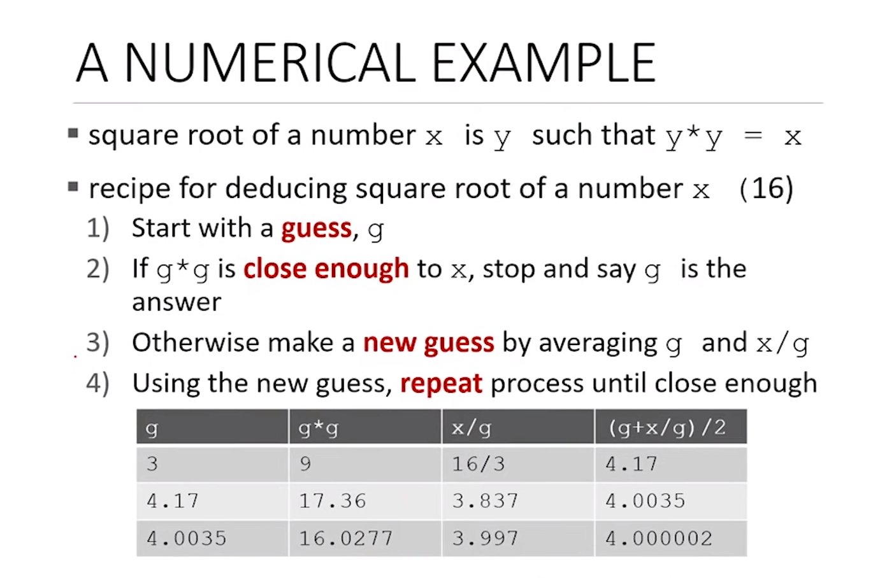
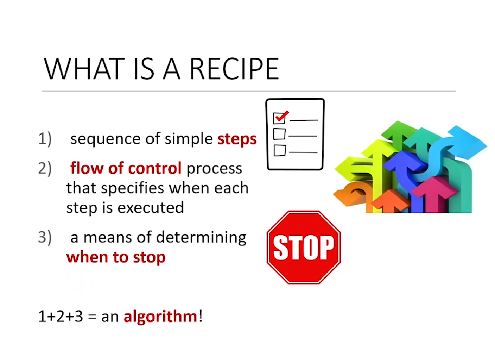
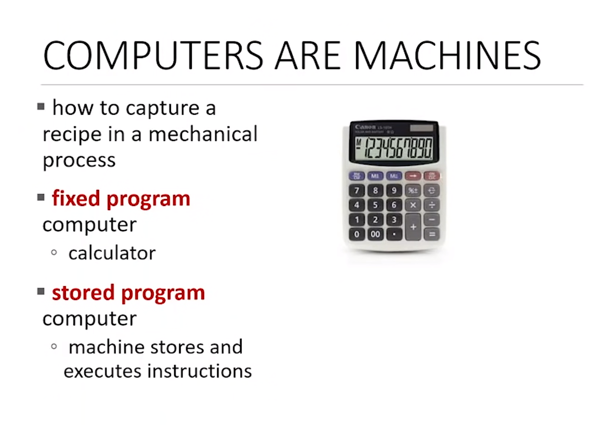
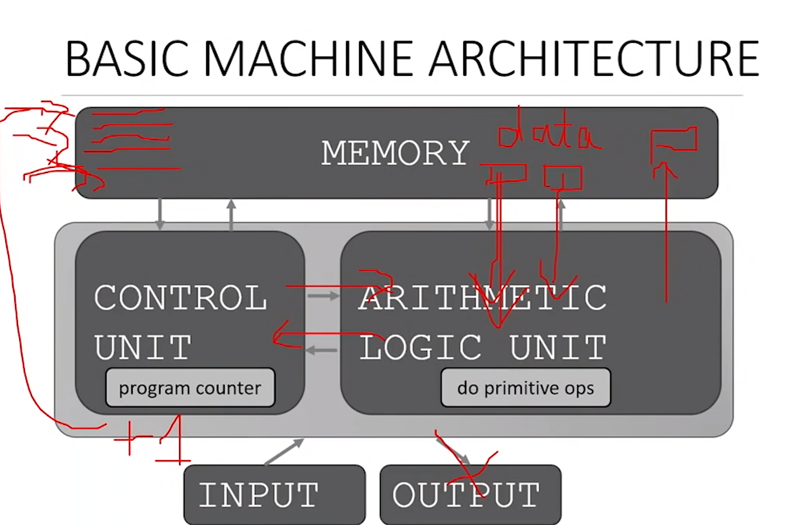
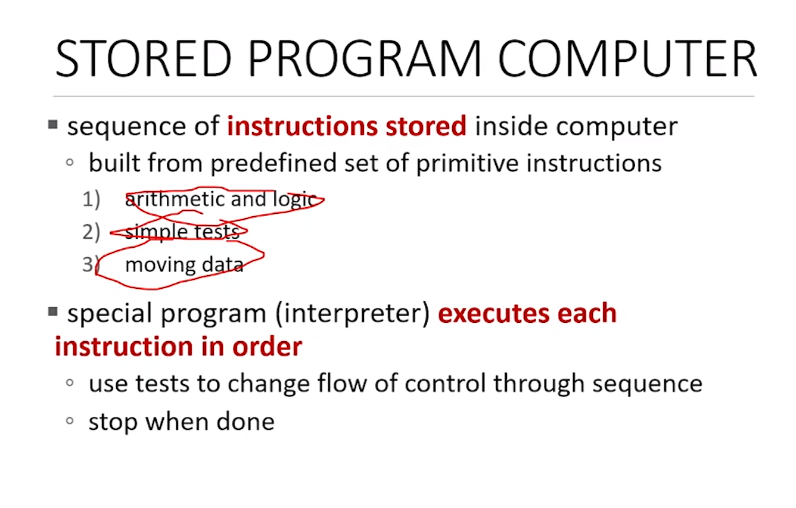
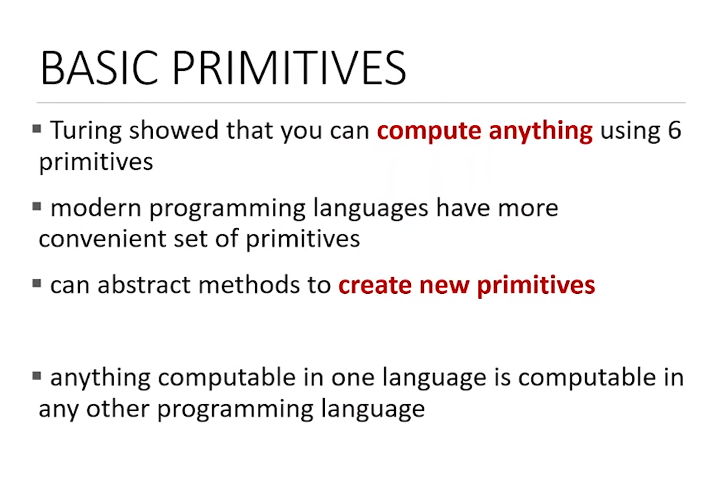
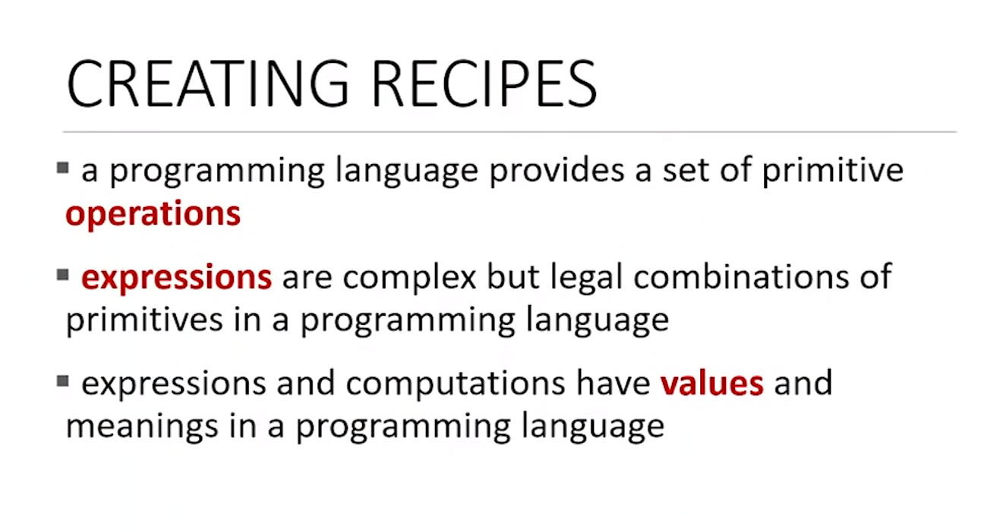
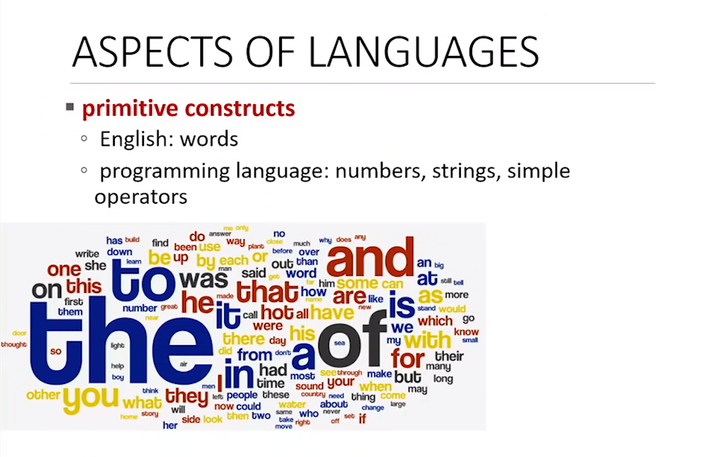

# What is Computation ?

## Source: 

- https://www.youtube.com/watch?v=nykOeWgQcHM

## Notes

### Programming

- Need Practice, a lot of programming.

### Roadmap

### Learning Topics

- First two point are related to programming, how you can a program!

- Last two points are about Computer Science, (i.e. How you will know that one program is efficient than other program. ) 

- Learning to program, representing the knowledge with data structure.

- How do you good code, readable and understandable!

### What Does a Computer Do

- They perform very fast calcutation.

- They remember results, by storing them in the memory.

#### Kinds of Calculation that Computers Do:

- One are calculations are built-into language. (i.e. addition, subtraction, multiplication etc.)
- Other that you define by using the fundamental one.

**COMPUTERS ONLY DO WHAT YOU TELL THEM TO DO**

#### Types of Knowledge:

**Declarative Knowledge**
- statements of fact.

**Imperative Knowledge**
- sequence of steps

**A Numerical Example**:

**Imperative Knowledge Recipe Example**

#### Types of Computers

#### Basic Working of a Computer

**Stored Program Computer**:

#### Alan Turing 6 Instruction to Compute Anything!

- Alan Turing describes that you only need these 6 Basic Primitives to Compute anything:
    1. Move Left
    2. Move Right
    3. Read
    4. Write
    5. Scan
    6. Do Nothing

- Using those 6 Instructions programming language came about!

- Important thing that came out of it was that If you can write something in one programming like python or anything the same can be done in some other programming language.

#### Creating Expressions

- these are going to be the combinations of primitives!

#### For Example, Take English Language:

