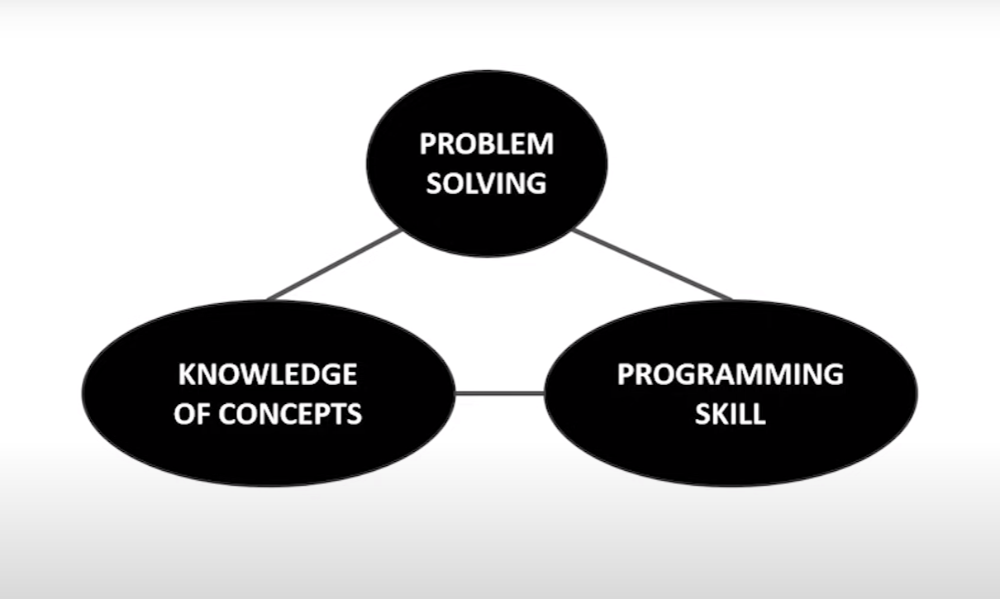
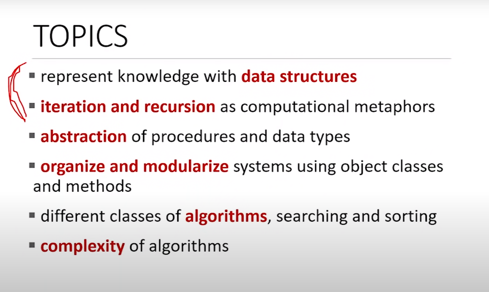
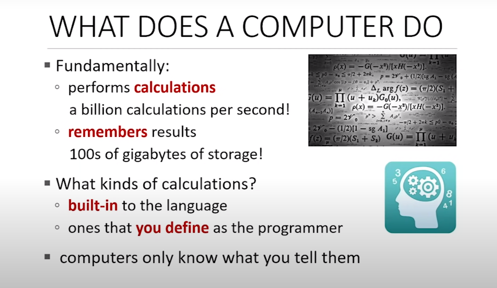
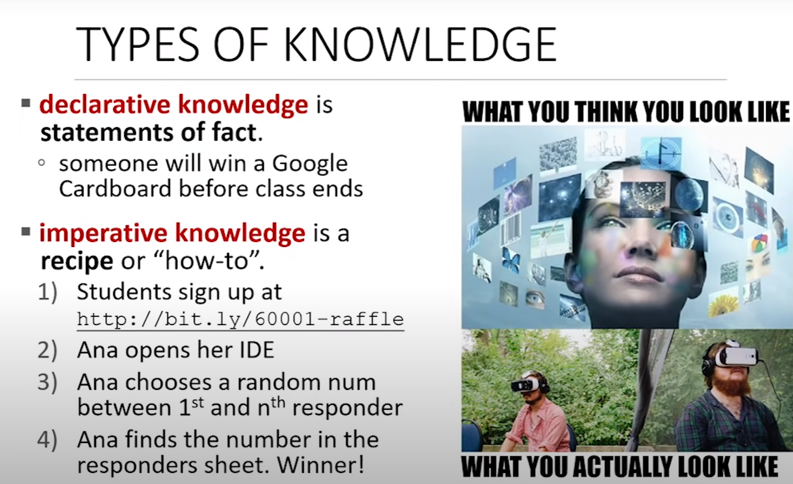

# What is Computation

## Source: 

- https://www.youtube.com/watch?v=nykOeWgQcHM

## Notes

### Programming

- Need Practice, a lot of programming.

### Roadmap

### Learning Topics

- First two point are related to programming, how you can a program!

- Last tow points are about Computer Science, (i.e. How you can that how a program is much efficient that other ) 

- Learning to program, represent knowledge with data structure.

- How do you good code, readable and understandable!

### What Does a Computer Do

- They perform very fast calcutation.

- They remember results, by storing them in the memory.

#### Kinds of Calculation that Computers Do:

    - One are calculations are built-into language. (i.e. addition, subtraction, multiplication etc.)
    - Other that you define by using the fundamental one.

**COMPUTERS ONLY DO WHAT YOU TELL THEM TO DO**

#### Types of Knowledge:

