# Introduction to Computer Science

## By: Anna Bell

## Contents:

- Course Info
- What is computation
- python basics
- mathematical operation, you can do with python
- python variables and types

## Tips

- get familiar with the terminologies, later then you can become more sure about it!

- Test and Practice!

## Roadmap:

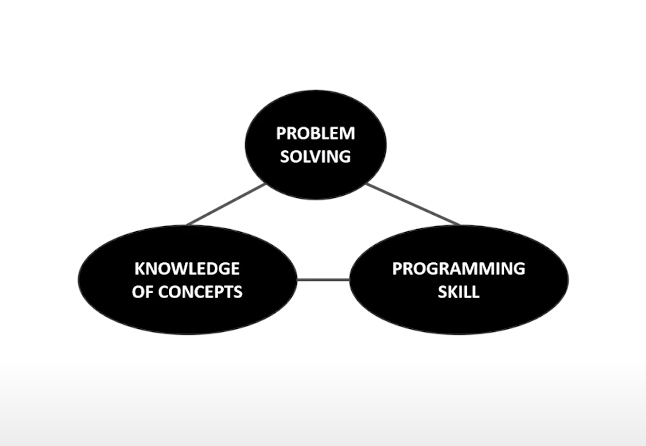

## Things that we are going to learn:

![imgs/img02.png]

1. Learning how to program? How to represent Knowledge with Data Structure!

2. How do you write good code, good style! has to be readable and understable, for that it should well organized, modular and easy to understand.

3. the last one deals with Computer Science; once you write a program, how do you get know that how a program is better than other program.

## What Does a Computer Do?

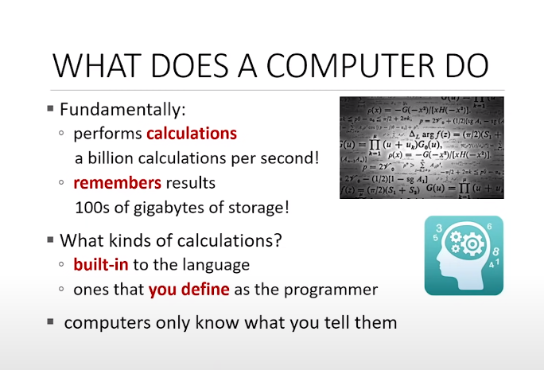

- Fundamentally Computers do, Two things:
    1. Performs **calculations**
    2. **Remembers** results

- Kinds of Calculations:
    1. **built-in** to the language (i.e. Addition, Substraction, Multiplication, etc.)
    2. and then you **define** your own calculations.

**Computers Only Know What You Tell Them!**

## Types of Knowledge

1. **Declarative Knowledge**
    - is a **statements of facts.**

2. **Imperative Knowledge**
    - Tells how to conduct something to gain something.
    - Sequence of steps.

### Numerical Example to Show the Difference Between Declarative and Imperative Knowledge!

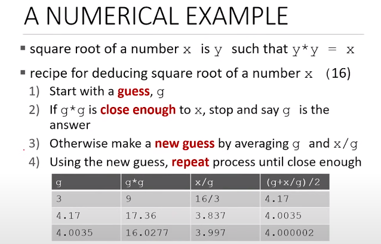

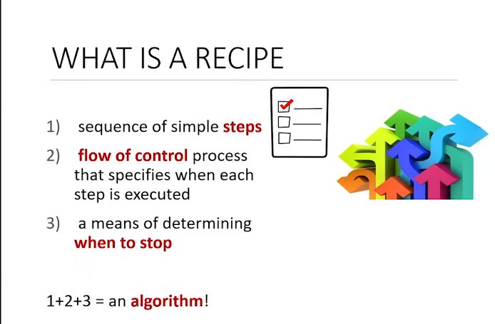

- Recipe is an algorithm in Computer Science.

## Types of Computers

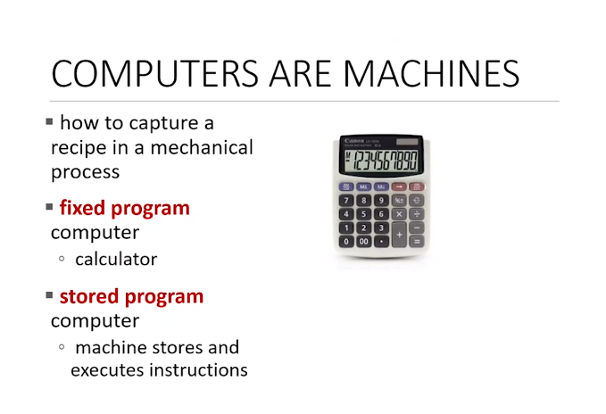

1. **Fixed Program Computers**
    - calculators

2. **Stored Program Computers**
    - machines stores and executes instructions

## Basic Computer Architecture

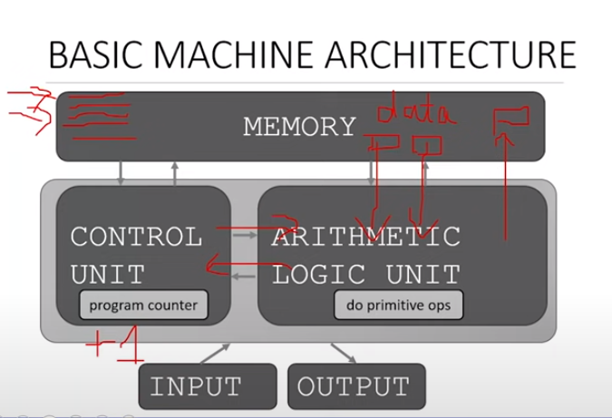

- Memory contains a bunch of data and sequence of instruction.

- Interacting with ALU is the Control Unit,

- And Control Unit, it contains one program counter, it gets the first instruction and sends it to the ALU.

- ALU then check whats happening and it might get some data from memory do some operation and stores the data back into the memory.

- When dones the program increase to +1 and go on to next instruction.

- There might be one particular instruction that done some particular test, like is one value is greater or smaller than other. And depending on the result we can go in the instruction wherever we want. Some control flow involved.


**Recap**:

- You the stored program which has the sequence of instructions.

- The primitive operations it can do is addition, substraction, logic operations etc.
and moving data.

- And the interpreter goes through every instruction whether to decide you need to go to the next instruction, skip instruction, repeat instruction etc.


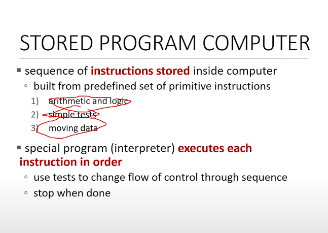


## Alan Turing 6 Primitives to Compute Anything:

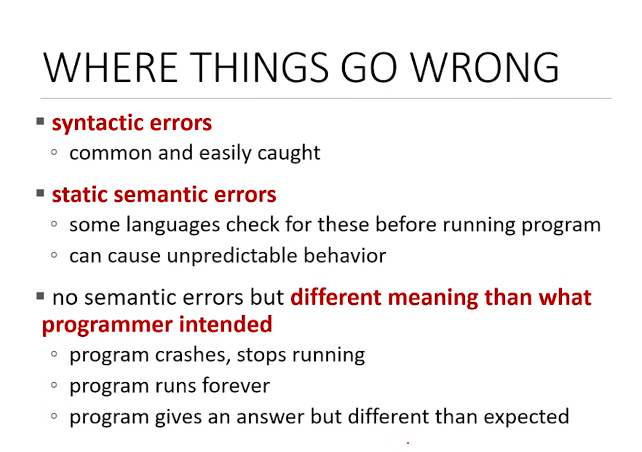

### 6 Primitives:
    1. Move Left
    2. Move Right
    3. Read
    4. Write
    5. Scan
    6. Do Nothing

- Using these primitives programming language came about.

- If you can compute something in python or any other programming language, in theory you can write a program that compute the exact same thing in other programming language. **A Really Powerful Statement**

## Creating Recipes

- Once you have set of primitives, set of primitives in a particular language.

- You can start creating expressions, these are the combinations of the primitives in the programming language, are going to have some values and some meaning in the programming language.

### English, as an example!

- **Primitive Constructs**:
    - English: words
    - programming language: numbers, strings, simple operators

- Using these primitive contructs of english language, we start creating phrases and setences.

### Aspects of Languages

- Syntax
    - **English**: "cat dog boy" -> not syntactically valid
                   "cat hugs boy" -> syntactically valid
    - **programming language:** "hi"5 -> not syntactically valid
                                "3.2\*5" -> syntactically valid

- Static Semantics
    - **English**: "I are hungry" -> syntactically valid
                                     but static semantic error
    - **programming language**: 3.2\*5 -> syntactically valid
                                3+"hi" -> static semantic error

- Semantics
    **In English**:
    What is the meaning of phrase?
    For example "Flying planes can be dangerous" can have two meanings:
        1. the act of flying plane is dangerous
        2. the flying plan that is the air is dangerous
    **Programmming Language**:
    the programming language have one meaning but the problems occurs when the program does something which programmer didn't intended to do!


## Python Programs

- A **program** is sequences of definitions and commands
    - we going to have expressions which are going to be evaluated!
    - commands that going to tell interpreter to do something!

### Objects

- Python programs manipulat this data objects
- All Objects in python have the data type, it tells python to kind of operation python should do on these objects.

**Objects Types**:

1. **Scalar Objects** is a non-scalar objects, these are very basic object, they can't be subdivided. ex: number 5

2. **Non-Scalar**: they have some internal structure, they can be subdivided (i.e. List of numbers (5,6,7,8)

#### Scalar Objects

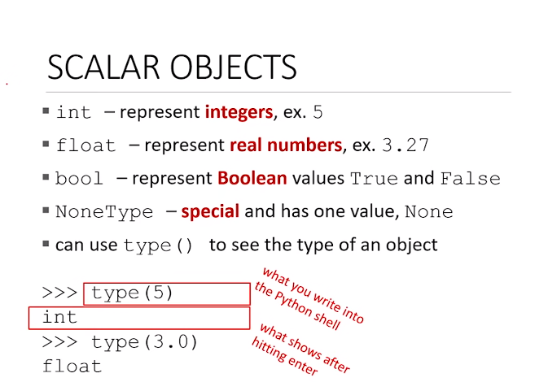

### Type Conversions (Cast)

- can convert the type that we want to convert to!


- converting from float to interget it trucates as a result.

### Print things Out

- Interacting with the user.

- For that we have to use the **print** function, running on shell is just peeking into the value!

### Expressions

- Once we have objects then we can combine objects and operators to form these expressions.

- Each expression is going to have some values, expressions evaluates to a value!

- syntax for a simple expression:
    ```
    <object> <operator> <object>
    ```

### OPERATORS ON ints and float

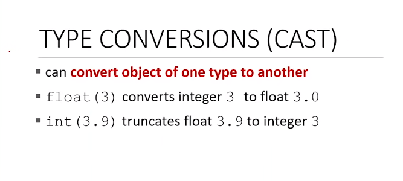

### Variables

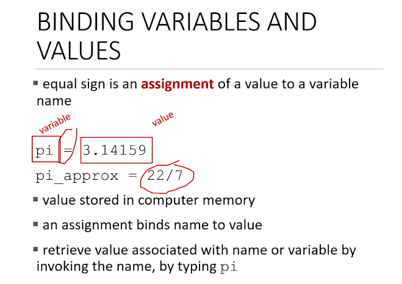

- Using the variable in the program is mean that you are refering that value in memory.

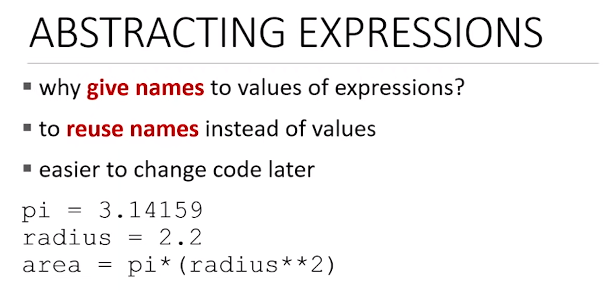

## Programming Vs Math

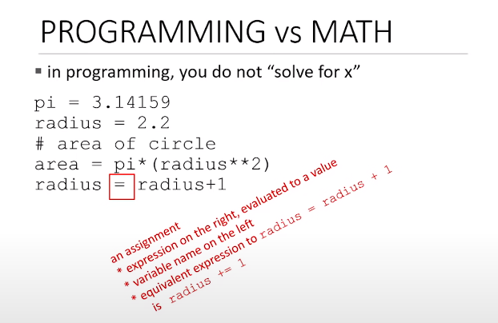


