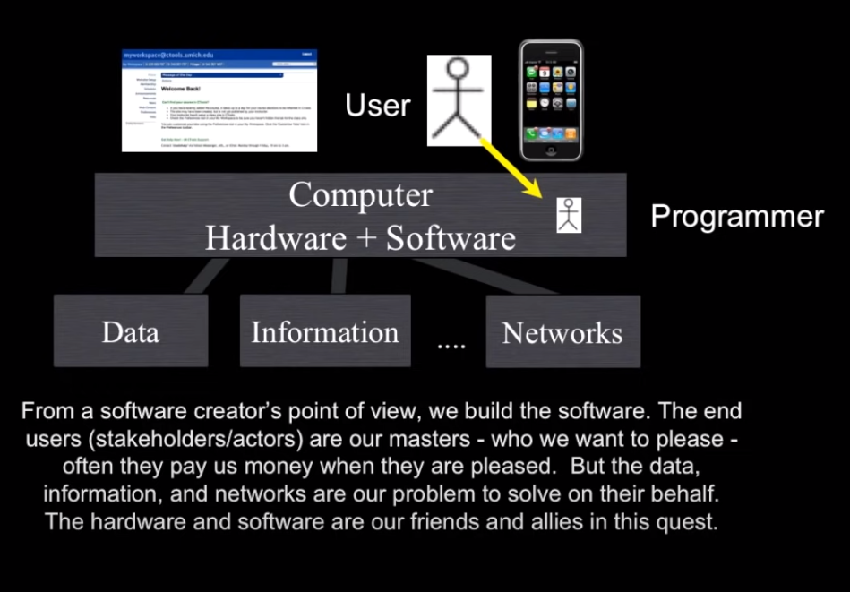
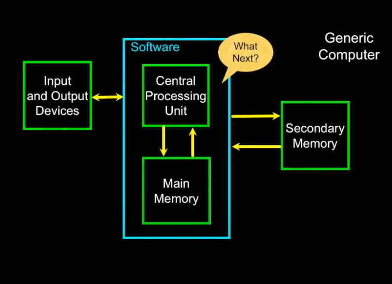
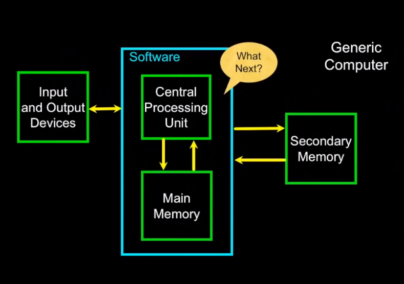

# Why Program

## Source: https://www.py4e.com/lessons/intro#

**Computers wants to be helpful**

- To instruct them and tell them what to do to make our life easier.

**Programmers Anticipate Needs**

**Users Vs. Programmers**

- Using the tools within the computers to allow us to make programs that are useful to us.

**Why be a Programmers**

- Writing programs to solve our jobs.

- Also fixing problems and bugs within the computers.

**What is Code? Software? A Program?**

- a sequence of stored instructions

- a piece of creative art

### Hardware Architecture

#### Generic Computer

Brain in Computer --> Microprocessor

Memory and CPU works together like: Processor Demands Instructions and Memory which have stored instructions in it, delivers to the Processor as per demand.

